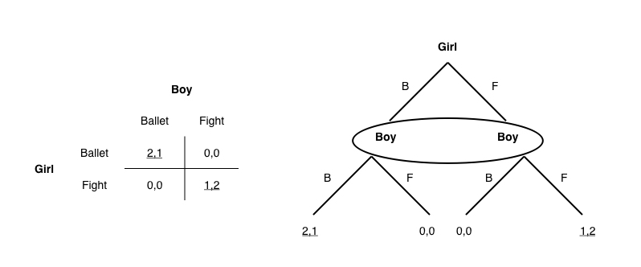
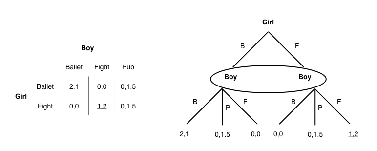
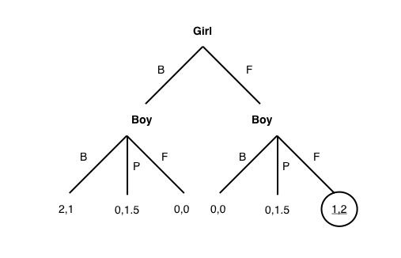
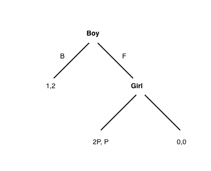

```{r, message=FALSE, warning=FALSE, include=FALSE}
library(ggplot2)
library(dplyr)
```

## Question 1: Dynamic battle  
### A.   
The pure strategy Nash equilibria for this game are for the girl and boy to go to either the fight or the ballet together. The mixed strategy Nash equilibrium for this game is for each person to go to each venue with probability $0.5$.  
    

### B.   
The pure strategy Nash equilibrium for this game is for the girl and boy to go to the fight together.      

### C.   
The subgame perfect Nash equilibrium for this game is for the girl and boy to go to the fight together.     

### D.   
The subgame perfect Nash equilibrium for this game is for the girl and boy to go to the fight together.     

### E.   
The equilibria are for the boy to go to ballet if $p < 0.5$, to go to the fight if $p > 0.5$, and to flip a coin to decide if $p = 0.5$. In short, the more certain the boy is that the girl can recieve texts, the more his expected payoff from calling her bluff.  
    

\newpage
## Question 2: War of attrition revisited - multiple players  
### A.  
The the pure strategy Nash equilibria for this game are the three scenarios in which two players exit immediately and one stays in as long as possible, e.g. $x_1 = 0, x_2 = 0, x_3 = \infty$ with the resulting payoffs $u_1 = 0, u_2 = 0, u_3 = V$. The mixed strategy Nash equilibrium for this game is a PDF equal to the derivative of the square of the PDF of the mixed-strategy Nash equilibrium of the two-player game: $$\frac{e^{\frac{-x}{v}}\left(1-e^{\frac{-x}{v}}\right)^{-\frac{1}{2}}}{2v}$$ with payoffs $u_1 = u_2 = u_3 = 0$.  

###B.  
The pure strategy Nash equilibria in this game involve two players quitting immediately in both rounds and one player staying in long as possible for both rounds, e.g. $x_1 = y_1 = 0, x_2 = y_2 = 0, x_3 = y+3 = \infty$ with the resulting payoffs $u_1 = 0, u_2 = 0, u_3 = V$.

###C.  
This game is equivalent to the one in question B because each dynamic n-player game reduces to a static n-player game. So the portion of the dynamic game with 3 players reduces to a 3-player static game. After the first player quits, the new game can be reduced to a 2-player static game. A subgame perfect Nash equilibrium for this dynamic game is thus a strategy set that results in a Nash equilibrium for both 2-player and 3-player static games.  

###D. 
If there is no cost to proceed from the 1st to the 2nd round of the game, there is a mixed-strategy subgame perfect Nash equilibrium at $$x_i = y_i = \frac{e^{\frac{-x}{v}}\left(1-e^{\frac{-x}{v}}\right)^{\frac{1}{n-1}-1}}{(n-1)v}$$ where n = # of players remaining in the game and the expected payoff for all players is $0$. 

###E. 
A subgame-imperfect Nash equilibrium for this game involves all players quitting immediately in round 1 ($x_i = 0)$, and the remaining two players playing the mixed-strategy Nash equilibrium for the 2-player war of attrition ($y_i = \frac{1}{v}e^{\frac{-x}{v}}$).

\newpage
## Question 3: 
###A.  
Via backward induction, we can conclude that the subgame perfect Nash equilibrium for this game is for the player who moves first (Player 1) to always stay, and for the player who moves second (Player 2) to always quit.  

###B. 
Via backward induction, we can conclude that the subgame perfect Nash equilibrium for this game is for both players to always stay to recieve the payoff $\frac{V}{2}$. This result holds as long as $\frac{V}{M} > C$. If this is not the case, then the subgame perfect Nash equilibrium is the same as in A.  

###C.  
The symmetric subgame perfect Nash equilbirium of this game if for both players to always quit.
```{r}
M <- 6 ; V <- 5 ; C <- 1
p.quit <- V/2 - (M - 1) * C
p.stay <- V/2 - M * C

# payoffs for round M
p.quit
p.stay
```


\newpage
### Question 4: The Good, the Bad, and the Ugly  
This game involves a finite number of heterogenous players, so I used an agent-based model to solve it. Answers to the questions below were determined using the following model written in NetLogo:  

```
breed [ players player ]


players-own
[
  accuracy  ;; probability that player will hit opponent
  alive?    ;; boolean operater to tell if player has been shot
  ammo      ;; number of bullets each player has
]


globals [ payoff ]  ;; payoff for Player 1 (# of rounds survived)


to setup
  clear-all

  set payoff 0

  create-players 3
  [
   set alive? true
   set accuracy q     ;; give players user-defined accuracy betweeen 0 and 1
   set ammo 500       ;; give players "unlimited" ammo
   set shape "person"
  ]
                      ;; note that player IDs are zero-initial, so player 0 is Player 1, etc.
  ask player 0
  [
    setxy -1 1
    set color green
  ]

  ask player 1
  [
    set ammo bullets  ;; change Player 2's ammo to user-controlled number of bullets
    setxy 1 1
    set color blue
  ]

  ask player 2
  [
    set accuracy .9   ;; change Player 3's accuracy to 0.9
    setxy 0 -1
    set color yellow
  ]

  reset-ticks
end


to go
  clear-links

  ifelse sequential? = false   ;; check if play is simultaneous or sequential
  [
    ask players [shoot]        ;; if play is simultaneous, players shoot sequentially (random order)
    check-die                  ;; but die simultaneously
  ][                           ;; if play is sequential, players shoot and die sequentially 
                               ;; (specified order)
    foreach [ 0 1 2] [
      ask turtle-set player ? [shoot]  ;; "turtle-set" command used here so asking dead players to 
                                       ;; shoot doesn't stop the simulation
      check-die
    ]
  ]
end


to shoot                              ;; routine for players to pick a target (rationally) and shoot
  if ammo > 0                         ;; only shoot if player has ammo
  [
    if random-float 1 < accuracy  ;; players have same accuracy regardless of target, so check if
                                  ;; shot hits first
    [
      ifelse who = 0                  ;; Player 1 has special shoot command because they are aware 
                                      ;; of Player 2's ammunition
        [let target max-one-of other players with [ammo > 0] [accuracy]
         ifelse target != nobody ;; Player 1 targets other player with highest accuracy, 
                                 ;; as long as they have bullets
           [ask target [
               set alive? false
               create-link-from myself]]
           [ask turtle-set player 1 [
               set alive? false
               create-link-from myself]]] ;; If only target is ammoless Player 2, shoot him
        [ask turtle-set max-one-of other players [accuracy] ;; Players 2 and 3 target 
          ;; other player with the highest accuracy
          [set alive? false
            create-link-from myself]]
    ]
    set ammo ammo - 1                 ;; if shot was successful, lose a bullet
  ]
end


to check-die  ;; routine to kill players that have been shot and to monitor Player 1's payoff
    if count players <= 1 [stop] ;; stop the simulation if one or no players remain
    if diag? = false [ask players with [alive? = false] [ die ]]      ;; kill players that have 
                                                                      ;; been shot
    if player 0 != nobody [set payoff payoff + 1]  ;; if Player 1 is alive, increase their payoff
    tick
end
```


###A.  
Player 1 should load **1** bullet into the gun of player 2 if $Q = 0.5$.   

###B.  
Player 1 should load **0** bullets into the gun of player 2 if $Q = 0.95$.  
  
```{r, echo=FALSE, message=FALSE, warning=FALSE}
simul <- read.csv('truel simultaneous-table.csv', skip = 6) %>% 
  group_by(bullets, q) %>% 
  summarise(payoff = mean(payoff))
sequen <- read.csv('truel sequential-table.csv', skip = 6) %>% 
  group_by(bullets) %>% 
  summarise(payoff = mean(payoff), 
            prob = sum(as.numeric(player.0....nobody)-1)/10000)

max.p <- simul %>% 
  group_by(q) %>% 
  summarise(payoff = max(payoff)) %>% 
  select(payoff) %>% 
  unlist

ggplot(data = simul, aes(x = bullets, y = payoff, group = q)) +
  geom_hline(yintercept = max.p, linetype = 2) +
  geom_line(aes(color = factor(q))) +
  geom_text(x = 3, y = max.p[1], label = max.p[1], vjust = 2) + 
  geom_text(x = 3, y = max.p[2], label = max.p[2], vjust = 2) + 
  labs(title = "Payoffs for Player 1 w.r.t. number of bullets in Player 2's gun\n", 
       x = "\nBullets in Player 2's gun", y = "Payoffs to Player 1\n") +
  scale_color_discrete(name = 'Q') +
  theme_minimal()
```   

###C.  
Player 1 should load **0** bullets into the gun of Player 2 in a game of sequential play. The probability that Player 1 will survive to the end of the shooting match if Player 2 has 0 guns is $.65$.  

\newpage
## Question 5: Infinite centipede game  
### A.  
The pure strategy symmetric and time-invariant subgame perfect Nash equilibrium for this game if for both players to always quit ($s_i^k = p = 0$). 

### B.
A symmetric subgame perfect Nash equilibrium that is not time invariant is a mixed strategy found by determining the expected payoffs for each player in round $k$
$$\begin{aligned} u_1^k & = \beta^k (pk + k - 2p) \\ u_2^k&  = \beta^{k-1}(pk - k) \end{aligned}$$
and setting them equal to each other to determine the value of the symmetrical mixed strategy $p$
$$\beta^k (pk + k - 2p) = \beta^{k-1}(pk - k)$$ $$p = \frac{\beta k - k}{-\beta k + k +2\beta} = s_i^k$$  
